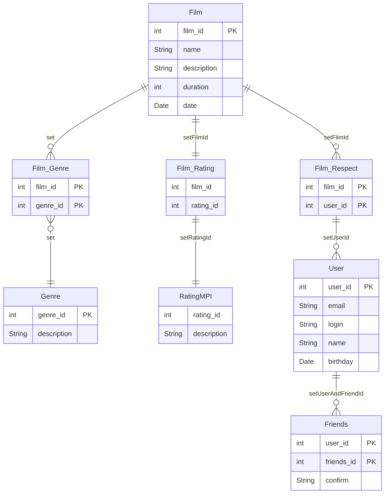

# java-filmorate
Template repository for Filmorate project




```markdown
#получение списка общих друзей
SELECT friends_id 
FROM Friends  
WHERE user_id=1 OR user_id=3 GROUP BY friends_id 
HAVING COUNT(*) > 1; 

```
```markdown
#самый популярный фильм
SELECT MAX(c) 
FROM (
    SELECT COUNT(user_id) as c 
    FROM Film_Respect 
    GROUP By film_id)
```